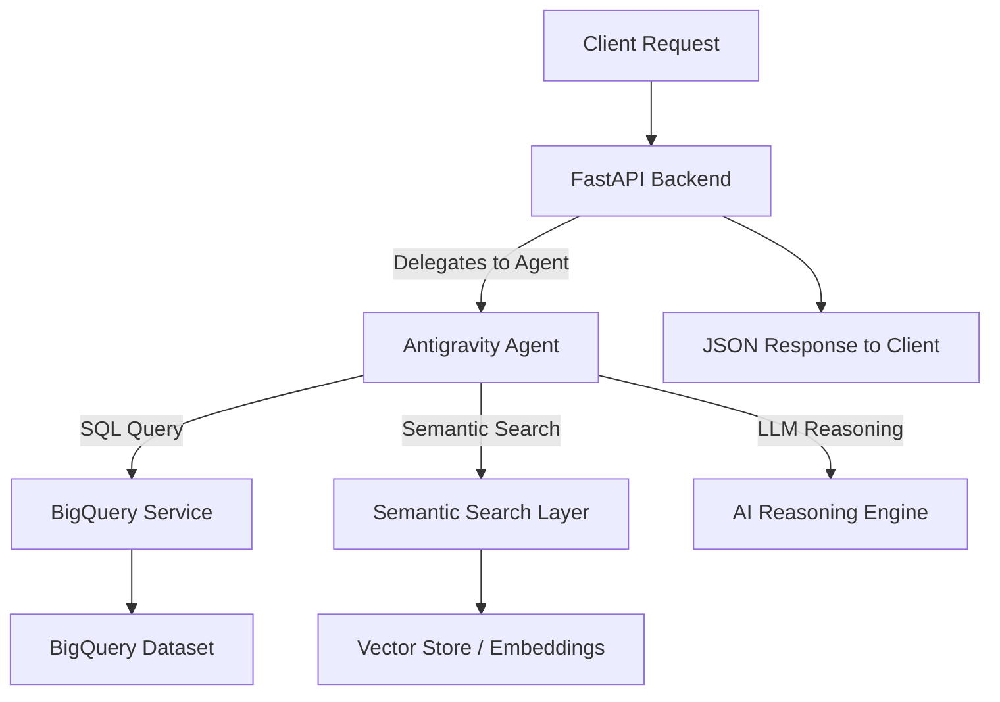

# customer-support-intelligence-agent


A FastAPI‑based system that integrates Google BigQuery, semantic search, an AI reasoning engine, and Antigravity’s agent execution environment to deliver analytics and intelligent insights on customer support data through a unified REST API.

---

# **1. Project Goal**

The objective of this project is to build a modular, cloud‑integrated intelligence layer for customer support operations.  
The system enables:

- Execution of analytical SQL queries on support datasets  
- Semantic similarity search across historical tickets  
- AI‑driven reasoning and summarization  
- Agent‑oriented orchestration using Antigravity  

The design emphasizes clear separation of concerns, scalable components, and compatibility with both local and cloud environments.

---

# **2. Workflow**

The system processes incoming requests through a coordinated sequence of backend services and agent‑driven logic.

### **Step 1 — Client Request**
A client sends one of the following:
- SQL query  
- Semantic search prompt  
- Natural‑language question  

### **Step 2 — FastAPI Backend**
The backend:
- Validates the request  
- Routes it to the appropriate internal service  
- Delegates reasoning tasks to the Antigravity agent  

### **Step 3 — Antigravity Agent Layer**
The agent:
- Interprets the request  
- Selects and invokes tools (BigQuery, semantic search, vector store)  
- Applies execution policies  
- Produces structured outputs  

### **Step 4 — BigQuery Execution (if applicable)**
- Executes SQL queries using ADC  
- Returns structured results  

### **Step 5 — Semantic Search (if applicable)**
- Generates embeddings  
- Searches the vector store  
- Returns top‑K matches  

### **Step 6 — AI Reasoning (if applicable)**
- Synthesizes retrieved context  
- Generates a natural‑language or structured JSON response  

### **Step 7 — Response Delivery**
The backend formats and returns the final output to the client.

---

# **3. Architecture Overview**

The system is composed of four primary subsystems:

- **FastAPI Backend** — Entry point for all client interactions  
- **Antigravity Agent Layer** — Orchestrates reasoning and tool execution  
- **Data Services** — BigQuery integration and semantic search  
- **AI Reasoning Engine** — LLM‑based synthesis and response generation  

These components operate independently but integrate seamlessly through well‑defined interfaces.

---

# **4. Architecture Layers (Detailed Explanation)**

### **A. FastAPI Backend**
- Hosts REST endpoints  
- Handles routing, validation, and response formatting  
- Delegates reasoning tasks to the Antigravity agent  
- Provides a unified API surface for all operations  

### **B. Antigravity Agent Layer**
- Defines the agent’s behavior, tools, and execution policies  
- Manages reasoning steps and tool invocation  
- Integrates with local and cloud resources  
- Ensures consistent agent behavior across environments  

### **C. BigQuery Integration Layer**
- Executes SQL queries against support datasets  
- Uses Application Default Credentials for authentication  
- Supports dynamic and parameterized queries  
- Returns structured results for analytics and reasoning  

### **D. Semantic Layer**
- Generates embeddings for support tickets  
- Stores vectors in a local or cloud‑based vector store  
- Performs similarity search for retrieval‑augmented reasoning  

### **E. AI Reasoning Engine**
- Synthesizes retrieved context  
- Generates natural‑language answers  
- Produces structured JSON outputs for downstream consumption  

### **F. Data Pipeline**
- Ingests raw support ticket data  
- Cleans and normalizes text  
- Generates embeddings  
- Updates the vector store  

### **G. Optional Docker Deployment**
- Containerized backend  
- Consistent runtime across local and cloud environments  

---

# **5. Workflow Diagram**



---

# **6. Project Structure**

```
backend/
├── main.py               # FastAPI application and routes
├── routers/              # API endpoints
├── services/             # BigQuery, embeddings, agent logic
├── models/               # Pydantic request/response models
└── utils/                # Config, helpers, logging

semantic/
├── embed.py              # Embedding generation
├── vector_store.py       # Vector DB operations
└── config.py             # Semantic layer configuration

antigravity/
├── agent.yaml            # Agent definition and execution policies
├── tools/                # Tool definitions for BigQuery, search, etc.
└── workspace/            # Local Antigravity project files

data/
├── raw/                  # Input CSVs
├── processed/            # Cleaned datasets
└── embeddings/           # Generated vectors


Just tell me what you’d like next.
